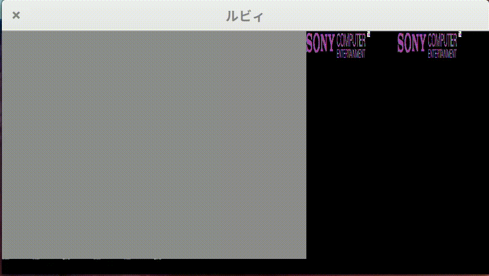

# Ruby (ルビィ)

> Waah! Wh-Wh-Wh-What is it?

Ruby (ルビィ) is a [PlayStation](https://en.wikipedia.org/wiki/PlayStation_(console)) emulator written in C++.



### Progress

- [x] CPU
- [x] RAM
- [x] DMA
- [ ] GPU
- [ ] CDROM
- [ ] Interrupts
- [ ] Timers
- [ ] Controllers and Memory Cards
- [ ] GTE
- [ ] SPU
- [ ] SIO
- [ ] PIO

### Building

#### Prerequisites

- PlayStation BIOS: SCPH1001 (SHA1: 10155d8d6e6e832d6ea66db9bc098321fb5e8ebf)
- Python 2.7
- [glad](https://github.com/Dav1dde/glad)
- C++17
- OpenGL 4.5
- SDL2

#### Compiling

```
$ make
```

### Acknowledgments

This emulator, like many others, is based on the [Nocash PSX Specifications](http://problemkaputt.de/psx-spx.htm). For ease of access and review purposes, relevant parts of the specification are pasted before the implementation.
